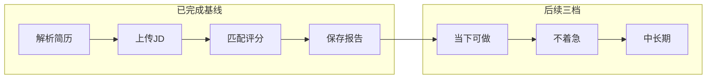

# 整改事项分阶段落地方案

> **基线版本**：`overseas-v2.0.1`（Deploy Overseas 已通过）  
> **日期**：2026-07-16  
> **原则**：Career 主链路可独立小步发版；PlanetX 多行业与 Trust Agent 不阻塞 MVP。

## 已完成（基线，不再列入待办）

- tier × role 前端差异化 + `SaasAdminGuard`
- 11 维评分 UI + gap analysis / improvement_plan
- 简历「带入匹配」+ JD 上传后引导
- 征信同公司 24h 缓存
- 匹配报告持久化：`match_reports` + `/v1/match-reports` + Jobs 保存 + Reports 列表/详情
- `report_generate` consent

---

## 一档：当下可做（`overseas-v2.0.x`）

目标：巩固「简历 → JD → 匹配 → 报告」演示与内测体验。

| 事项 | 状态 | 交付 |
|------|------|------|
| 匹配报告体验补齐 | 本迭代落地 | 详情 11 维 + gap；空态链到 `/jobs`；保存错误区分 consent |
| 报告导出 JSON | 本迭代落地 | `GET /v1/match-reports/:id/export` + 前端下载 |
| `/jobs` 轻量简历入口 | 本迭代落地 | 链到 `/resume`，不合并两端阶段 |
| 配额主动弱提示 | 本迭代落地 | free 接近日限时 Sidebar / Jobs 提示 |
| Smoke 清单 | 本迭代落地 | [SMOKE_MATCH_REPORT.md](./SMOKE_MATCH_REPORT.md) |
| 审计留痕 | 本迭代落地 | generate / view / delete / export / share* |

验收：内测账号走完「解析 → 带入 → 匹配 → 保存 → 查看 → 导出」无阻断。

---

## 二档：不着急做（`overseas-v2.1.x`）

目标：Career 深度与合规，仍不铺开多行业。

| 事项 | 状态 | 交付 |
|------|------|------|
| 报告授权（仅 career_partner） | 本迭代落地最小切片 | `report_sharing` 表；share API；维度勾选；`report_share` consent |
| 软删除物理清理 | 本迭代落地 | `POST /v1/match-reports/maintenance/purge`（admin，默认 30 天） |
| 批量征信 | 本迭代落地 | Jobs「一键查征信」串行 + 缓存 |
| supporter/pro 容量展示 | 本迭代落地 | Candidates 展示已用/上限（`CANDIDATE_LIMITS`） |
| job-posts 前端对齐 | 暂缓 | SaaS 尚未暴露职位发布页；有入口后再加 `TierGatePanel` |
| 匹配报告轻量对比 | 本迭代落地 | Reports 对比最近 2 份 max/avg |

验收：用户可「仅自己 / 授权合伙人」并撤回；大陆批量征信可用。

---

## 三档：中长期（`v2.2+` / 独立 epic）

目标：PlanetX 生态与信任层差异化。**不与海外小版本 tag 混绑。**

| 事项 | 说明 | 依赖 / Owner |
|------|------|-------------|
| `partner_profiles` + 入驻审核 | 生态准入 | 运营流程 + admin UI |
| 多行业授权矩阵 | matchmaker / estate / insurance / training | 二档 career 授权稳定后扩展 `shared_with_type` |
| 机构端脱敏查看 API | `require_report_sharing` + 行业二次脱敏 | sharing 表 |
| 按行业专业服务引擎 | 推荐 / 撮合 / 风控 / 课程 | 业务定义，非纯工程 |
| Trust Agent v2 / 废弃 degrees | 评审问答 P0–P1 | Jason · 信任层主线 |
| PostgreSQL 迁移评估 | 写入并发上来后再做 | 观测 QPS / WAL |
| 报告 PDF / 联邦学习等 | 商业与合规增强 | 有明确客户或赛事要求再开 |

---

## 版本策略

| 周期 | 版本 | 内容 |
|------|------|------|
| 当下 | `overseas-v2.0.x` | 一档体验 / 导出 / Smoke |
| 不急 | `overseas-v2.1.x` | career 授权 + 批量征信 + 容量 UI |
| 中长期 | `v2.2+` / 独立 epic | PlanetX + Trust Agent |

发版：`release/overseas` → `overseas-vX.Y.Z` → push `github` + `origin`（Gitee）。

---

## 明确不做

- 不把匹配报告塞进运营 `/v1/reports`（使用 `/v1/match-reports`）
- 不一期做满五行业授权面板与生态广场
- 不合并 C 端简历解析与 B 端 JD 为「一键全自动」
- 不新建完整 feature-flag 平台；继续 `hasMinTier` / consent / 路由守卫

---

## 外部文档索引

- `CodeBuddy/20260715163127/T空间-简历JD匹配操作指引.md`
- `CodeBuddy/20260715163127/匹配报告持久化&隐私授权联动技术方案.md`
- `CodeBuddy/20260715163127/评审模拟问答_Looma-Zervi.md`
