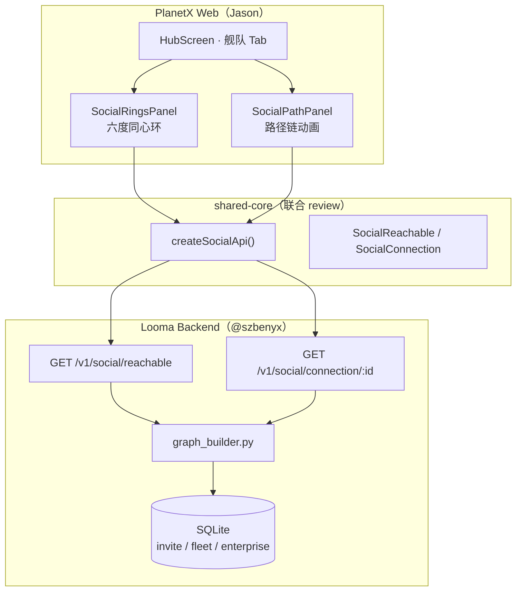

# 六度同心环 — 联调联试落地 Runbook

> **版本：** 1.0 · **日期：** 2026-07-09  
> **状态：** 🚀 待执行  
> **范围：** P0「六度同心环」+ 配套「路径链」轻量动画（不含力导向全图 P2）  
> **受众：** Jason（PlanetX / 小程序 / shared-core）、@szbenyx（后端 / T-space / 运维）  
> **关联文档：**  
> - [SOCIAL_GRAPH_GUIDE.md](./SOCIAL_GRAPH_GUIDE.md) — 算法与 API 真源  
> - [INTERNAL_TEST_READINESS.md](./INTERNAL_TEST_READINESS.md) — 内测验收  
> - [DUAL_REPO_WORK_GUIDE.md](./DUAL_REPO_WORK_GUIDE.md) — 双仓分工  
> - `packages/planetx/src/brand/ANIMATION_SPEC.md` — 动画 Token

---

## 1. 文档目的与 Done 定义

### 1.1 目的

将后端已上线的 `/v1/social/*` 能力，在 **PlanetX C 端**落地为可演示、可内测的「六度同心环」可视化，并建立 **前后端 + 双端联调** 的可执行清单，避免：

- 前端各自 `fetch`、契约 drift  
- 本地图谱为空导致「做了但看不到」  
- 动画与 API 字段理解不一致  
- 小程序 / Web 能力边界混淆  

### 1.2 P0 Done 定义（全部勾选 = 可对内测 / 深创赛演示）

```text
[ ] 1. shared-core 发布 createSocialApi + 类型（双 review 合并）
[ ] 2. PlanetX Hub「舰队」Tab 展示六度同心环（含空态 / 加载态 / 错误态）
[ ] 3. 同心环数字与 GET /v1/social/reachable 字段一致（人工对照 curl）
[ ] 4. 点击某度环可展开该度摘要（至少显示人数 + 信任区间文案）
[ ] 5. 路径链组件可演示：查询任意 user_id 的 connection 动画（≥2 个节点时有链）
[ ] 6. 本地种子图谱脚本可一键造 7+ 用户 / 10+ 边（联调不再空图）
[ ] 7. verify-social-rings.sh 脚本全绿（见 §7）
[ ] 8. 联调记录表签字（§9 模板）
```

**最小可演示集（深创赛应急）：** 1 + 2 + 6 + 7。

---

## 2. 架构与数据流

### 2.1 一句话

```text
用户登录 JWT → PlanetX 拉 reachable → 渲染 1~6 度同心环
            → 可选查 connection → 渲染路径链动画（中间人高亮）
```

### 2.2 拓扑



### 2.3 图谱边来源（联调造数必读）

| 边类型 | 数据表 | 如何产生 |
|--------|--------|----------|
| 推荐边 | `invite_codes` | A 创建邀请码 → B 使用注册 |
| 舰队边 | `fleet_members` | 同舰队 ≥2 人互连 |
| 企业边 | `enterprise_users` | 同企业 ≥2 人互连 |

**冷启动提示：** 仅注册用户、无邀请 / 舰队 / 企业关系时，`reachable` 全为 0 — 属正常，需执行 §6 种子脚本。

---

## 3. 团队分工对照表

| 任务 ID | 内容 | Owner | Reviewer | 预估 |
|---------|------|-------|----------|------|
| **B-1** | 确认 `reachable` / `connection` 响应稳定，端口 5200 | @szbenyx | Jason | 0.5d |
| **B-2** | `scripts/seed_social_demo.py` 本地造图（7 用户 + 链 + 舰队） | @szbenyx | Jason | 0.5d |
| **B-3** | `scripts/verify-social-rings.sh` 烟雾脚本 | @szbenyx | Jason | 0.5d |
| **B-4** | （可选 P1）`reachable` 增加 `self_included: false` 文档澄清 | @szbenyx | — | 0.25d |
| **S-1** | `types/social.ts` 类型定义 | Jason | @szbenyx | 0.25d |
| **S-2** | `createSocialApi()` Web + Mini 工厂 | Jason | @szbenyx | 0.5d |
| **S-3** | `API_ROUTES` 增加 SOCIAL_* 常量 | Jason | @szbenyx | 0.25d |
| **S-4** | `shared-core` 导出 + 单测 1 条 | Jason | @szbenyx | 0.25d |
| **F-1** | `SocialRingsPanel.tsx` 同心环 UI | Jason | 设计 | 1d |
| **F-2** | `SocialPathPanel.tsx` 路径链 UI | Jason | 设计 | 0.5d |
| **F-3** | `HubScreen` 舰队 Tab 接入 + 空态文案 | Jason | — | 0.5d |
| **F-4** | `useSocialGraph.ts` hook（loading/error/refresh） | Jason | — | 0.5d |
| **F-5** | 动画：`ringExpand` / `numberRoll` 接入 ANIMATION_SPEC | Jason | — | 0.5d |
| **T-1** | T-space 候选人页「信任度」徽章（读 degrees） | @szbenyx | Jason | P1 |
| **T-2** | Admin `network-stats` 简易看板 | @szbenyx | Jason | P2 |
| **M-1** | 小程序 Hub 静态同心环（无 Canvas 力导向） | Jason | — | P1 |
| **Q-1** | 联调验收 + 截图归档 | 双方 | — | 0.5d |

### 3.1 边界规则

| ❌ 不要 | ✅ 应该 |
|--------|--------|
| PlanetX 直接 `fetch('/v1/social/...')` 散落多处 | 统一走 `createSocialApi(client)` |
| 前端自行 BFS 算度数 | 只消费后端 `reachable` / `connection` |
| 在 SaaS 复刻一套 social 类型 | 从 `@looma/shared-core` 导入 |
| 小程序上力导向大图 | P0 仅同心环 + 数字；路径用纵向链 |
| 把志愿者密码写进联调文档 | 用 `内测志愿者账号与入口.example.md` |

---

## 4. API 契约（P0 冻结）

> **真源：** `backend/src/api/routes/social_routes.py` · 变更须先改本文档再改代码

### 4.1 GET `/v1/social/reachable`

**请求**

```http
GET /v1/social/reachable?max_depth=6
Authorization: Bearer <looma_jwt>
```

**响应 200**

```json
{
  "max_depth": 6,
  "total_reachable": 6,
  "total_users": 7,
  "reach_percentage": 100.0,
  "by_degree": {
    "1": "2",
    "2": "3",
    "3": "1"
  }
}
```

**前端映射规则（强制）**

| 字段 | UI 用途 |
|------|---------|
| `by_degree["1"]` … `by_degree["6"]` | 第 N 环人数（缺省视为 0） |
| `total_reachable` | 环心副标题「N 位星际邻居」 |
| `reach_percentage` | 底部进度条 / 百分比 |
| `total_users` | 仅调试；**不要**当分母重算百分比 |

**信任度环配色（与后端一致）**

| 度数 | 信任区间 | Token 色 |
|------|----------|------------|
| 1 度 | 90 | `--px-color-accent` (#C8FF50) |
| 2 度 | 70 | `--px-color-cyan` (#00E5FF) |
| 3 度 | 50 | `--px-color-primary` (#6C63FF) |
| 4 度 | 30 | `--px-color-gold` (#FFD700) |
| 5 度 | 15 | `--px-color-pink` (#FF2D95) |
| 6 度 | 5 | `--px-color-text-muted` |

### 4.2 GET `/v1/social/connection/<user_id>`

**用途：** 路径链面板；`user_id` 为 Looma 用户 UUID。

**响应 200（已连接）** — 字段见 SOCIAL_GRAPH_GUIDE §4.1

**响应 404（不可达）** — UI 显示「六度之外，暂无星际航道」

### 4.3 shared-core 目标接口（S-2 交付物）

```typescript
// packages/shared-core/src/types/social.ts
export interface SocialReachable {
  max_depth: number;
  total_reachable: number;
  total_users: number;
  reach_percentage: number;
  by_degree: Record<string, number>;
}

export interface SocialChainStep {
  step: number;
  user_id: string;
  display_name: string;
  role: string;
}

export interface SocialConnection {
  connected: boolean;
  degrees: number;
  path: string[];
  chain: SocialChainStep[];
  trust_score: number;
  message: string;
}

// createSocialApi(client) → reachable / connection / degrees
```

**Mini 端：** 在 `createMiniApi.ts` 镜像相同三个方法（P1 可与 Web 同步交付）。

---

## 5. 前端 UI 规格（PlanetX P0）

### 5.1 组件清单

| 组件 | 路径（建议） | 职责 |
|------|-------------|------|
| `SocialRingsPanel` | `features/social/SocialRingsPanel.tsx` | 六环 + 中心「你」+ 数字滚动 |
| `SocialPathPanel` | `features/social/SocialPathPanel.tsx` | 路径节点纵向链 + 逐段亮起 |
| `useSocialGraph` | `features/social/useSocialGraph.ts` | 拉 reachable、缓存 60s |
| `DegreeRing` | `brand/ui/DegreeRing.tsx` | 单环 SVG / CSS |

### 5.2 挂载点

```text
HubScreen.tsx · tab === 'team'
  ├── FleetPanel（保留）
  └── SocialRingsPanel（新增）
        └── 「查看航道」→ SocialPathPanel
```

### 5.3 空态 / 加载 / 错误

| 状态 | 条件 | 文案 |
|------|------|------|
| 加载 | 请求中 | `PlanetXLoading` |
| 空图 | `total_reachable === 0` | 「邀请好友加入舰队，点亮星际网络」+ 复制邀请码 |
| 错误 | 401 / 5xx | Toast + 重试 |
| 仅自己 | `total_users <= 1` | 「你是这片星域的第一位探索者」 |

### 5.4 动画（对齐 ANIMATION_SPEC）

| 动效 | 触发 |
|------|------|
| `ringExpand`（新增） | 内环→外环 delay 120ms |
| `px-anim-numberRoll` | 人数滚动 |
| `pathGlow`（新增） | 路径每 step 600ms |
| `StarBackground` | 保持 |

---

## 6. 联调造数（B-2）

### 6.1 目标拓扑

```text
        [U3]
         |
[U1]—[U0 你]—[U2]
         |
    [U4]—[U5]—[U6]
```

U0/U1/U2 同舰队；U4/U5 同企业；推荐链造 1~3 度边。

### 6.2 手工造数（脚本未就绪时）

```bash
cd backend && ./dev.sh   # 另开终端

curl -s -X POST http://127.0.0.1:5200/v1/auth/register \
  -H "Content-Type: application/json" \
  -d '{"email":"ring-u0@test.local","password":"test123456","name":"RingU0"}'

# U0 创建舰队 → 邀请 U1/U2；创建 referral → U3 使用

curl -s http://127.0.0.1:5200/v1/social/reachable \
  -H "Authorization: Bearer <U0_TOKEN>" | python3 -m json.tool
```

### 6.3 脚本交付（@szbenyx）

- 路径：`scripts/seed_social_demo.py`  
- 幂等、可重复执行  
- 输出各 demo 用户 email / user_id / 预期 by_degree  

---

## 7. 联调执行顺序

### Phase A ⭐ 契约与造数

| 步骤 | 负责人 | 验收 |
|------|--------|------|
| A1 | @szbenyx | JWT + `/v1/social/reachable` 200 |
| A2 | @szbenyx | 种子后 `verify_integration` 节点 ≥7 |
| A3 | Jason | 确认 §4 字段 |
| A4 | 双方 | 冻结响应 shape |

### Phase B ⭐ shared-core

| 步骤 | 负责人 | 验收 |
|------|--------|------|
| B1 | Jason | PR: types + createSocialApi |
| B2 | @szbenyx | Review + typecheck 绿 |
| B3 | Jason | ApiClient 单测 +1 |

### Phase C ⭐ PlanetX UI

| 步骤 | 负责人 | 验收 |
|------|--------|------|
| C1 | Jason | dev 登录种子 U0 |
| C2 | Jason | 六环数字与 curl 一致 |
| C3 | Jason | connection 路径动画 |
| C4 | 双方 | 新用户空态无报错 |

### Phase D 烟雾归档

| 步骤 | 负责人 | 验收 |
|------|--------|------|
| D1 | @szbenyx | verify-social-rings.sh 绿 |
| D2 | 双方 | §9 记录表签字 |

---

## 8. 验收脚本模板（B-3）

见仓库 `scripts/verify-social-rings.sh`（待 @szbenyx 提交）。核心检查：

1. `/health` ok  
2. 注册用户 + `reachable` 结构完整  
3. `connection/self` → degrees=0, trust_score=100  
4. （可选）种子用户 `total_reachable > 0`  

```bash
./scripts/seed_social_demo.py
./scripts/verify-social-rings.sh
cd frontend && pnpm --filter @looma/planetx dev
```

---

## 9. 联调记录表

| 项目 | 值 |
|------|-----|
| 日期 | |
| API_BASE | |
| 种子用户 | |
| shared-core PR | |
| PlanetX 分支 | |

**截图：** 有数据环 / 空态 / 路径链 / curl 对照  

**问题单：** # | 现象 | 端 | 状态 | 负责人  

Jason ________  @szbenyx ________

---

## 10. 风险与决策

| 风险 | 缓解 |
|------|------|
| 图谱为空 | 种子脚本 + 空态 CTA |
| by_degree key 为字符串 | `Number(k)` + 单测 |
| 性能（每次重建图） | P1 TTL 缓存 5min |
| 小程序 Canvas 限制 | P0 仅 Web 动效 |

---

## 11. 推送策略

| 里程碑 | 推送 |
|--------|------|
| B-2 + B-3 | Gitee main |
| S-2 合并 | Gitee + GitHub |
| F-3 完成 | PR 独立合并 |
| §7 未绿 | 不触发生产 deploy |

---

## 12. 后续 P1/P2

| 阶段 | 内容 | Owner |
|------|------|-------|
| P1 | 小程序静态同心环 | Jason |
| P1 | T-space 信任度徽章 | @szbenyx |
| P1 | ego-network API | @szbenyx |
| P2 | 力导向全景图 | Jason |
| P2 | Admin network-stats 看板 | @szbenyx |

---

## 13. 命令索引

| 命令 | 用途 |
|------|------|
| `cd backend && ./dev.sh` | 后端 :5200 |
| `python -m src.social.verify_integration` | 图谱自检 |
| `./scripts/verify-p0-local.sh` | 全量烟雾 |
| `./scripts/verify-social-rings.sh` | 同心环专项 |
| `pnpm --filter @looma/planetx dev` | PlanetX |
| `pnpm --filter @looma/shared-core typecheck` | 类型检查 |

---

*契约变更：先更新本文档 §4 + SOCIAL_GRAPH_GUIDE.md，再提 PR。*
